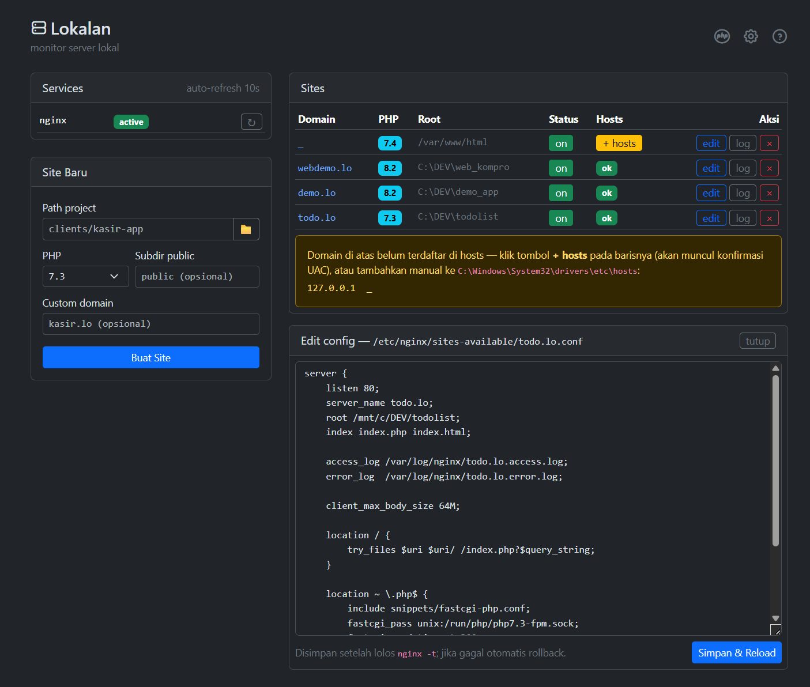

# Lokal Panel (Lokalan) — Panel Multi PHP + Nginx buat WSL di Windows

Panel tuk kelola multi php dengan WSL + nginx.

[](#)
[](#)
[](#)
[](#)
[](#)
[](#)
[](LICENSE)
[](#)

Buat ente yang mau kelola multi php di lokalan via WSL + Nginx, ini bisa jadi aplikasi yang cocok dan jadi alternatif xampp apa laragon dah, gak usah ribet. Cocok buat developer PHP/Laravel yang butuh **local development environment** dengan banyak versi PHP jalan bareng-bareng di satu mesin Windows.

Dari Lokalan, ente bisa:

- Ngeliat status web server sama semua versi PHP yang udah nampang (auto-refresh, gak usah refresh manual)
- Ngeliat daftar site/project lokal ente lengkap sama domain, versi PHP, sama lokasinya di mana
- Bikin site baru gampang, tinggal isi form doang (pilih folder, versi PHP, domain, kelar)
- Nyalain/matiin site, ganti versi PHP, ngeliat error log, sampe ngedit konfigurasi dengan aman (ada validasi otomatis + rollback kalo ente salah ketik)

Panelnya jalan di **Windows**, sedangkan servernya (nginx + PHP multi versi) jalan di **WSL** — Lokalan ini yang jadi jembatan di belakang layar, ente gak usah pusing mikirin.

> ⚠️ **Masih Beta ye bro.** Lokalan ini masih tahap beta, jadi masih mungkin ada bug nyempil di sana-sini. Semua resiko ditanggung sendiri ye, jangan langsung dipake buat server produksi. Backup dulu kalo perlu, lu... eh, ente yang tau sendiri lah gimana amannya.



---

## Aplikasi Ini Sebenernya Ngapain Sih?

Intinya, Lokalan ini tools buat nyetel multi versi PHP bareng nginx di dalem WSL, tapi dikontrolnya enak dari browser Windows ente.

Nah yang penting nih biar gak salah paham: Lokalan itu cuma yang **ngelola** doang, bukan yang **nyimpen**. Maksudnya gini — semua yang beneran di-setup (config nginx, config PHP-FPM tiap versi, file hosts, sampe si WSL-nya sendiri) itu tetep ada di tempat aslinya masing-masing, native di sistem. Gak ada satupun yang disimpen atau dikunci di dalem folder aplikasi ini.

Jadi:

- Config nginx? Ya tetep di `/etc/nginx/` dalem WSL, format standar nginx biasa.
- Config PHP-FPM tiap versi? Tetep di tempat masing-masing versi PHP-nya (`php7.4`, `php8.1`, `php8.3`, dst).
- File hosts Windows? Ya tetep di `C:\Windows\System32\drivers\etc\hosts`, cuma dibantuin nampilin baris yang perlu ditambah aje.
- WSL sendiri? Ya jalan sebagaimana WSL biasa, Lokalan cuma nembak perintah `wsl` ke situ.

Jadi kalo suatu saat Lokalan-nya dicopot atau gak dipake lagi, semua site sama config yang udah ente bikin tetep aman, gak ikut ilang, soalnya emang bukan Lokalan yang megang datanya — Lokalan cuma "remote control"-nya doang.

---

## Cara Kerjanya

```
                 ┌──  ENTE  ────────────────────┐
                 │                                │
          coding via VS Code            kelola via browser
                 │                                │
                 ▼                                ▼
  WINDOWS   C:\Dev\project-a          Lokalan  127.0.0.1:9000
                 │                                │
  ───────────────┼────────────────────────────────┼───────────
                 │ dibaca via /mnt/c              │ perintah wsl
                 ▼                                ▼
  WSL       nginx ──►  php7.4-fpm / php8.1-fpm / php8.3-fpm
                 │     (jalan bareng-bareng, satu site satu versi)
                 ▼
            http://project-a.lo   ←  buka aje di browser
```

Satu folder, dua dunia: `C:\Dev\project-a` (Windows) = `/mnt/c/Dev/project-a` (WSL). Kodenya gak pernah disimpen di dalem WSL ya — git, VS Code, sama tool lain tetep jalan native di Windows kayak biasa.

---

## Yang Musti Ada Dulu

- Windows 11 + WSL2 sama distro Ubuntu
- Python 3.9+ di Windows
- Server WSL udah di-setup (nginx + PHP multi versi) — script-nya udah dibawain sekalian di project ini, cek aje [scripts/README.md](scripts/README.md). Simpelnya tinggal: `sudo bash scripts/setup.sh` dari dalem WSL, sekali doang.

## Instalasi

**1.** Copy `panel.ini.example` jadi `panel.ini`, terus seting sesuai komputer ente :

```ini
[panel]
base_dir    = C:\Dev                       ; folder development ente
distro      = Ubuntu-22.04                 ; cek: wsl --list
scripts_dir =                              ; kosongin aje = otomatis (folder scripts di project ini)
port        = 9000
```

**2.** Double-click `run.bat` (auto-install dependency pas pertama kali jalan)

**3.** Buka **http://127.0.0.1:9000**

---

## Cara Makenya

### Bikin site baru

1. Taruh/clone project di folder development ente, misal `C:\Dev\project-a`
2. Di form **Site Baru**: klik 📁 buat milih folder, pilih versi PHP, isi subdir `public` kalo project-nya Laravel — domainnya otomatis jadi `project-a.lo`
3. Klik **Buat Site**
4. Tambahin domain ke file hosts (sekali doang per domain) — buka Notepad **as Administrator** → `C:\Windows\System32\drivers\etc\hosts` → tambahin baris yang ditampilin Lokalan:
   ```
   127.0.0.1  project-a.lo
   ```
5. Buka `http://project-a.lo` — kelar, gaskeun

**Kalo males pake panel** — bisa langsung via terminal WSL (script-nya ada di folder `scripts` project ini):

```bash
sudo bash scripts/new-site.sh -p project-a -v 8.3 -r public

# project di subfolder + custom domain
sudo bash scripts/new-site.sh -p clients/kasir-app -v 7.4 -d kasir.lo
```

Opsinya: `-p` path project (relatif dari `BASE_DIR`, apa absolut juga boleh), `-v` versi PHP, `-r` subdir document root (misal `public`), `-d` custom domain (kalo gak diisi default-nya `<nama-folder>.lo`). Detail lengkapnya di [scripts/README.md](scripts/README.md).

### Aktivitas Harian

| Butuh Apa | Caranya Gimana |
|---|---|
| Coding | Edit & save dari VS Code — langsung aktif, gak usah restart-restart |
| Git | Dari Windows aje kayak biasa |
| Ganti versi PHP site | Pencet tombol **edit** → ganti `fastcgi_pass` ke socket versi lain → Simpan |
| Site error | Pencet tombol **log** |
| Matiin/nyalain site | Tombol **on/off** |
| Restart nginx / PHP | Tombol ↻ di kartu Services |
| Composer/artisan | Terminal: `wsl php8.3 artisan migrate` (sesuain versinya) |

Ngedit config lewat panel dijamin aman kok, soalnya divalidasi `nginx -t` dulu, kalo gagal langsung rollback otomatis ke config sebelumnya.

### Kalo Ada Masalah

Buka **http://127.0.0.1:9000/debug** — bakal muncul hasil mentah semua perintah yang dipake panel, jadi langsung ketauan putusnya di mana. Penyebab paling sering: `distro` di `panel.ini` gak sesuai (cek pake `wsl --list`).

---

## Autostart (kalo mau, kalo ga ya udeh)

Biar Lokalan otomatis nyala pas ente login — Task Scheduler → Create Task:
- Trigger: At log on
- Action: `pythonw.exe` dengan argument `<lokasi-repo>\panel\panel.py`, start in `<lokasi-repo>\panel`

(`pythonw` = jalan tanpa nongolin jendela console.)

## Keamanan

- Lokalan cuma listen di `127.0.0.1` — gak bisa diakses dari jaringan luar, aman.
- Semua input divalidasi regex + `shlex.quote` dulu sebelom masuk shell.
- Aksi restart dibatesin whitelist (`nginx`, `php*-fpm`) doang.

## Issue

- **Performa I/O lintas filesystem (Windows ↔ WSL)** — karena project disimpen di Windows dan diakses WSL lewat `/mnt/c` (protokol 9P), akses file jadi lebih lambat dibanding native ext4 WSL. Kerasa banget pas request pertama / tanpa OPcache, soalnya PHP-FPM harus baca banyak file kecil (autoload, vendor) lewat 9P. Mitigasi sementara: pastiin OPcache nyala di tiap versi PHP, exclude folder `base_dir` dari Windows Defender real-time scan. **TODO:** cek/tambahin validasi & reminder otomatis di panel (misal warning kalo OPcache belom aktif buat suatu versi PHP), atau dokumentasiin setup optimal di `scripts/README.md`.

## Tips: biar kagak ribet urusan hosts lagi selamanya

Install [Acrylic DNS Proxy](https://mayakron.altervista.org/support/acrylic/Home.htm) di Windows, tambahin `127.0.0.1 *.lo` di AcrylicHosts.txt, terus set DNS adapter ke `127.0.0.1`. Semua domain `.lo` langsung jalan tanpa perlu edit hosts lagi, kolom "Hosts" di panel juga boleh dicuekin aje.

## Lisensi

Open source, gratis, bebas dipake — lisensi [MIT](LICENSE). Mau dipake buat project pribadi, dimodif, sampe dipasang di project komersial juga monggo, gak ada kewajiban balikin apa-apa. Cuma tinggal sertain notice copyright-nya aje.

---

**Keywords:** WSL2, WSL PHP multi version, nginx Windows panel, PHP local development, virtual host manager, alternatif XAMPP, alternatif Laragon, Laravel local dev Windows, panel PHP-FPM, nginx WSL Windows.

---

Ngide ide sambil ditemenin kupi kagak pake ruti dan asisten-AI. 🙏☕

